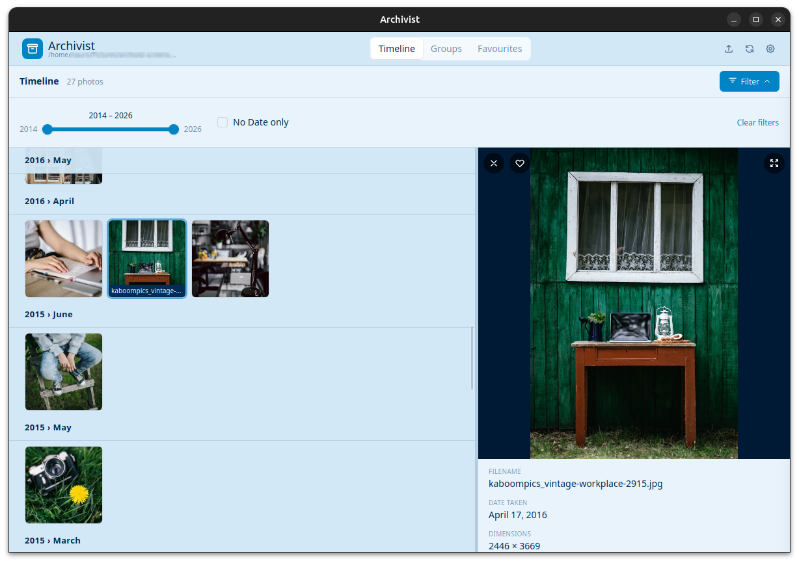
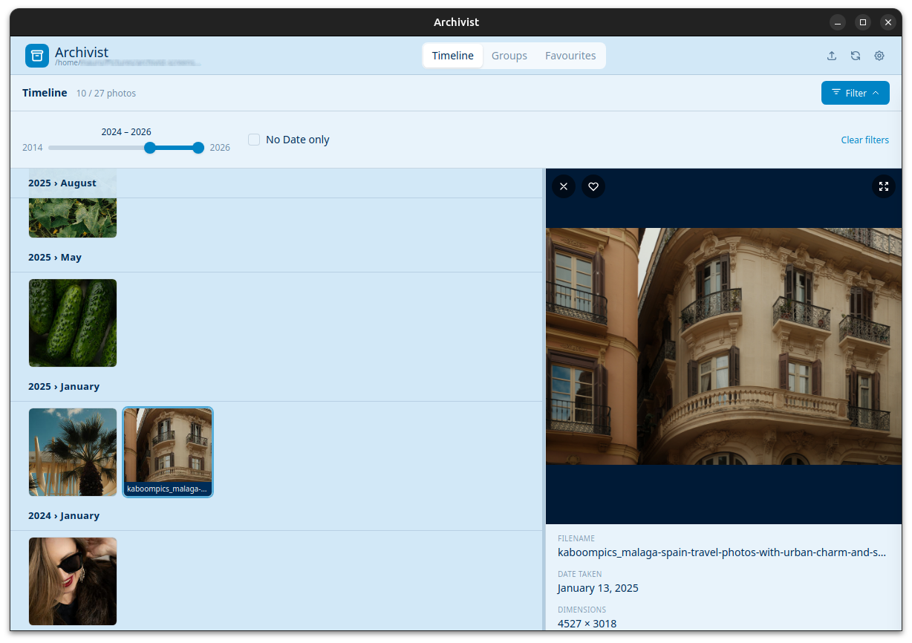
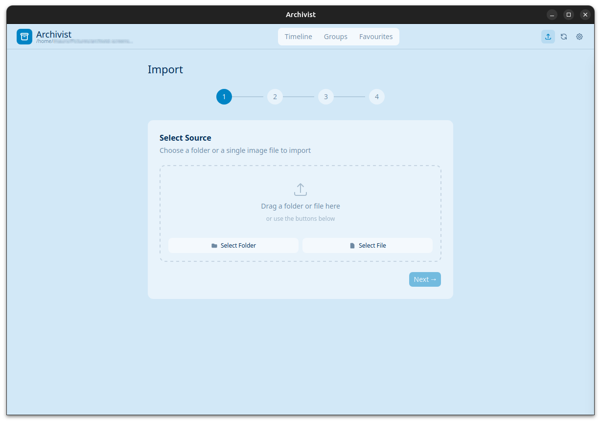
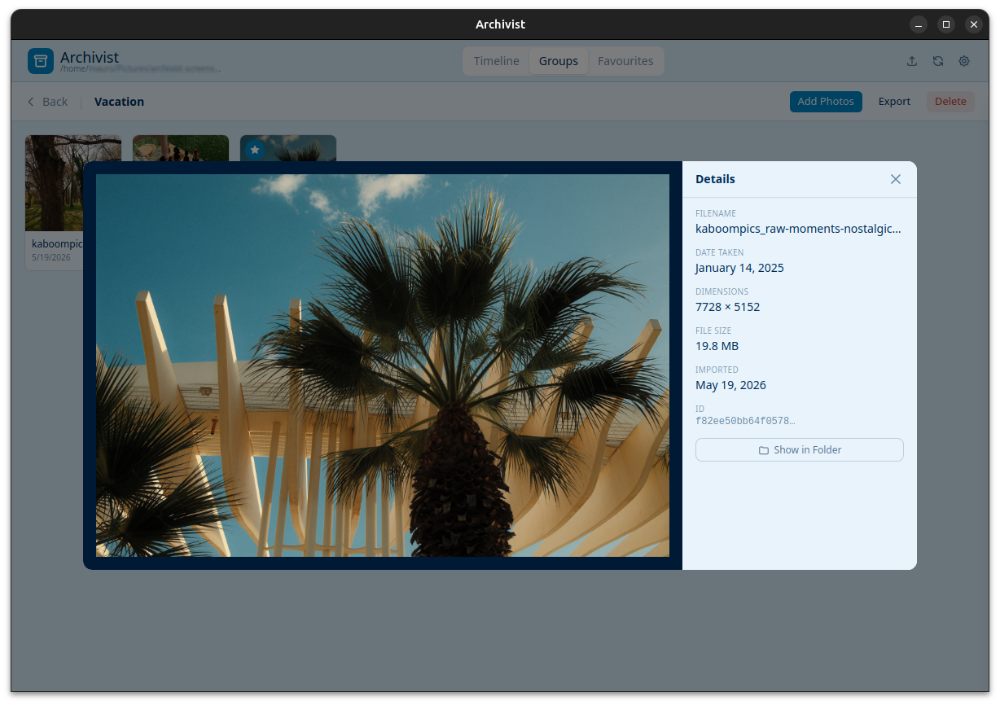
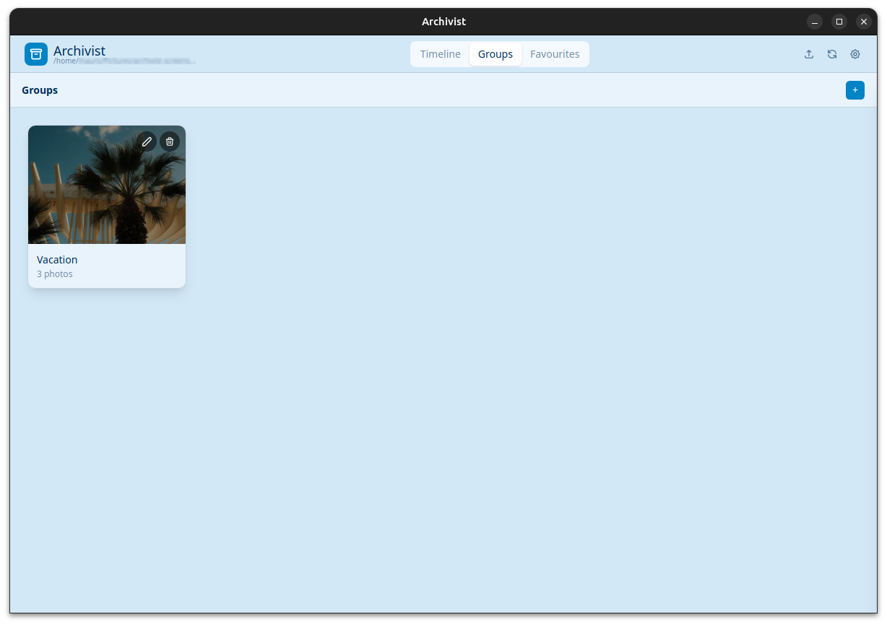

# Archivist

<p align="center">
  
</p>

<p align="center">
  
  
  
  
</p>

<p align="center"><em>Your photos, organized locally. No cloud. No accounts. No subscription.</em></p>

Archivist is a desktop photo archive organizer that imports, indexes, and browses your photos in a clean folder layout on disk — entirely offline, with no external services.

## Screenshots

<table>
  <tr>
    <td></td>
    <td></td>
  </tr>
  <tr>
    <td align="center"><em>Timeline — browse by date with filters</em></td>
    <td align="center"><em>Import — drag-drop with duplicate detection</em></td>
  </tr>
  <tr>
    <td></td>
    <td></td>
  </tr>
  <tr>
    <td align="center"><em>Detail — EXIF metadata + Show in Folder</em></td>
    <td align="center"><em>Groups — logical collections, no extra folders</em></td>
  </tr>
</table>

## Why Archivist?

- **100% local** — all data stays on your machine, zero telemetry, works fully offline
- **Duplicate-proof** — SHA-256 hash detection; re-importing the same photo is a no-op
- **Non-destructive** — always copies on import, never moves; originals untouched
- **Clean disk layout** — `YYYY/MM - MonthName/` folders you can browse without the app
- **Fast** — Rust backend with parallel processing and a thumbnail cache

## Download

Grab the latest installer from [**GitHub Releases**](../../releases/latest).

| Platform | Installer |
|----------|-----------|
| Linux    | `.deb`, `.AppImage` |
| Windows  | `.msi`, `.exe` (NSIS) |
| macOS    | `.dmg` (Intel + Apple Silicon) |

## Features

### Import
- **Drag-and-drop or button-pick** a source folder or individual file
- **EXIF date extraction** — DateTimeOriginal, CreateDate, DateTime, with filesystem-date fallback for non-EXIF images
- **SHA-256 duplicate detection** — re-importing the same file is a no-op
- **Conflict review UI** — keep existing, replace, or keep both side-by-side
- **Optional source deletion** after import
- **Thumbnail generation** at import time; thumbnails stored inside the archive

### Timeline
- Browse all archived photos in chronological order with sticky month headers
- Year-range slider and month filter for narrowing the view
- **No Date** filter for images with no date metadata
- Filter by group membership
- Click any photo to open a detail panel with EXIF metadata, dimensions, file size, group membership, and a **Show in Folder** button that opens the OS file manager at the image location

### Groups
- Create named logical collections — no physical folders created on disk
- Add photos from a full-screen picker that mirrors the timeline layout
- Remove individual photos from a group
- **Export a group** — copies all its photos to a chosen destination folder

### Archive management
- **Rescan** button in the navbar for quick re-indexing after external changes
- Rescan detects new files, removes stale DB entries, fixes incorrect dates, relocates misplaced files, and generates missing thumbnails
- Close and re-open an archive without restarting the app

Bilingual UI (English / Italian) — folder names on disk are always in English regardless of language setting. Configurable thumbnail size (Small / Medium / Large).

## Archive layout on disk

```
{archive_root}/
├── 2024/
│   └── 06 - June/
│       └── photo.jpg
└── .archivist/
    ├── archivist.db
    └── thumbnails/
        └── {sha256}.jpg
```

## Development

### Prerequisites

- Node.js 20+
- Rust latest stable
- Linux only: `libwebkit2gtk-4.1-dev libappindicator3-dev librsvg2-dev patchelf`

### Setup

```bash
npm install
npm run tauri dev
```

### Build (current platform)

```bash
npm run tauri build
```

### Cross-platform release builds

A GitHub Actions workflow is included at `.github/workflows/release.yml`.
Push a `v*` tag to trigger builds for Linux, Windows, and macOS simultaneously:

```bash
git tag v0.1.0
git push origin v0.1.0
```

A draft GitHub Release is created automatically with all platform installers attached.
The workflow can also be triggered manually from the Actions tab (`workflow_dispatch`).

### Bumping the version

Version must be updated in three files before tagging:

| File | Field |
|------|-------|
| `src-tauri/tauri.conf.json` | `"version"` |
| `src-tauri/Cargo.toml` | `version` (line 3) |
| `package.json` | `"version"` |

```bash
# 1. Edit version in all three files (e.g. 0.2.0)

# 2. Commit
git add src-tauri/tauri.conf.json src-tauri/Cargo.toml package.json
git commit -m "chore: bump version to 0.2.0"

# 3. Tag and push — triggers the release workflow
git tag v0.2.0
git push origin main
git push origin v0.2.0
```

Tag name and version in files must match.

| Platform | Artifacts |
|----------|-----------|
| Linux | `.deb`, `.AppImage` |
| Windows | `.msi`, `.exe` (NSIS) |
| macOS | `.dmg` (Intel + Apple Silicon) |

## Tech Stack

| Layer | Technologies |
|-------|-------------|
| Frontend | React 19, TypeScript 5, Tailwind CSS 4, shadcn/ui, Radix UI |
| State | Zustand 5 (6 stores), React Router 7 |
| i18n | i18next + react-i18next (en / it) |
| Backend | Rust, Tauri v2, rusqlite (SQLite bundled) |
| Images | kamadak-exif, image crate, sha2, rayon |
